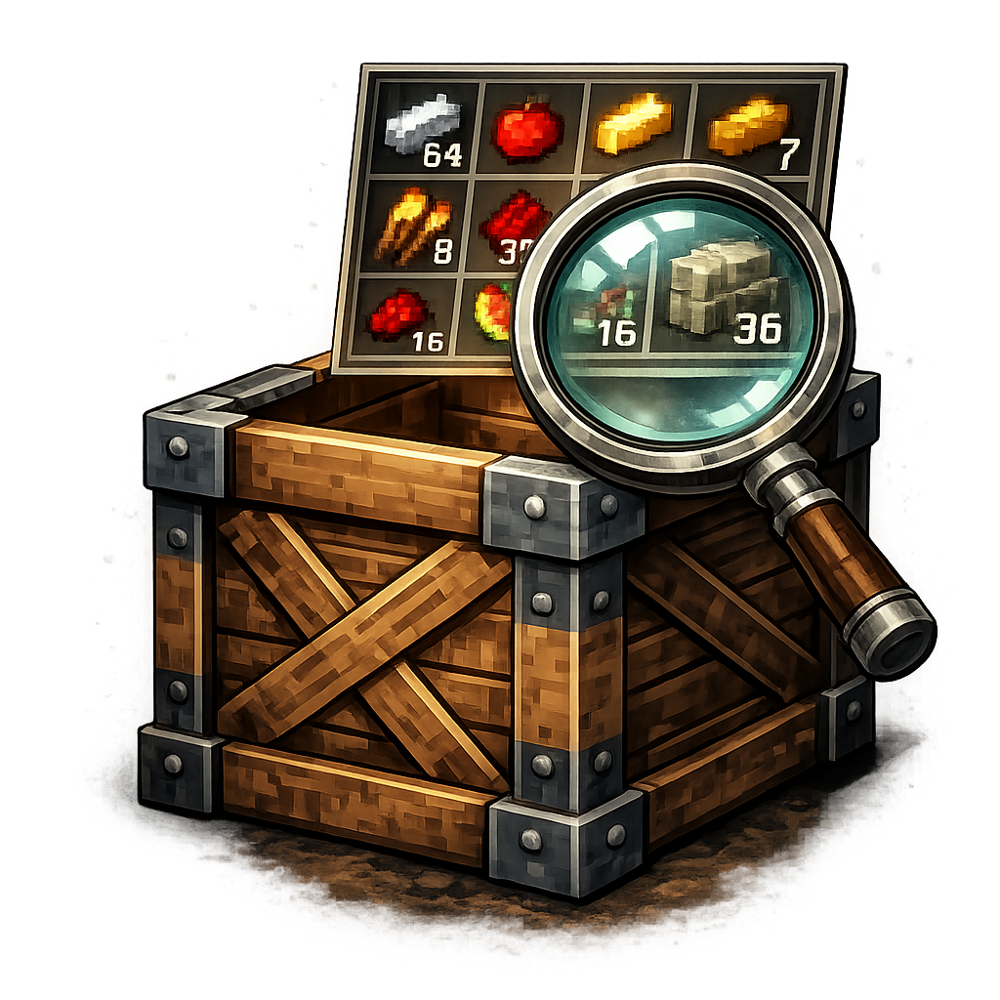

# Engineer's Crate Preview

Client-only NeoForge 1.21.1 / Java 21 tooltip previews for Immersive Engineering crates and compatible industrial crate items. The feature is inspired by redcatone's What's In My Crate (WIMC), but implemented with modern NeoForge tooltip component APIs.

## Features

- Uses `RenderTooltipEvent.GatherComponents`, `TooltipComponent`, `ClientTooltipComponent`, `RegisterClientTooltipComponentFactoriesEvent`, and `GuiGraphics`.
- Detects Immersive Engineering `crate` and `reinforced_crate` safely when IE is loaded.
- Supports opt-in industrial crate items through the `wimc:industrial_crates` item tag.
- Reads vanilla `DataComponents.CONTAINER` first, with defensive fallbacks for item capabilities and unresolved loot-table components.
- Renders a 9-wide grid, stack counts, empty slots when enabled, and row clamping through client config.
- Keeps all GUI classes behind a client-only entrypoint so dedicated server startup does not load client rendering classes.

## Client Config

The generated client config exposes:

- `enableCratePreview = true`
- `requireShiftForPreview = false`
- `maxPreviewRows = 6`
- `showEmptySlots = true`
- `enableImmersiveEngineeringCrates = true`
- `enableOwnModCrates = true`

## Attribution

Original WIMC author: redcatone.

Original WIMC license: MIT.

This implementation does not copy original WIMC source or assets. Preserve the WIMC MIT notice if original material is reused later.
